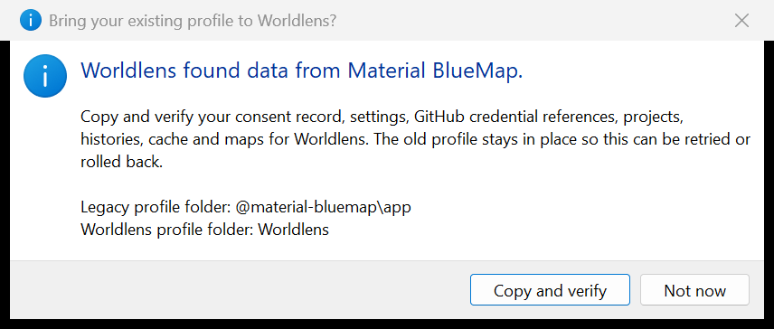

# Migrating from Material BlueMap to Worldlens

Worldlens is the new product and package identity. It remains a from-scratch TypeScript port of
[BlueMap](https://github.com/BlueMap-Minecraft/BlueMap); BlueMap is the upstream renderer and
viewer project, and this project does not claim that name or erase that credit.

## Behaviour

The first Worldlens launch looks for the legacy Windows profile at
`%APPDATA%\@material-bluemap\app`. When it exists, the app asks once before copying anything.
Acceptance copies through a staging directory, verifies every legacy file by SHA-256, writes a
receipt, activates `%APPDATA%\Worldlens`, and verifies it again. The legacy profile is retained.
Declining is remembered without nagging; retry remains an explicit action.

Before the existing Worldlens root can be renamed, migration writes and flushes
`%APPDATA%\.worldlens-profile-migration-transaction.json`. The journal records the exact source,
staging, current, backup and failed paths; the source manifest; and the durable phase. Every
startup recovers that transaction before reading a success receipt: a completed activation is
verified and finalized, while a partial or failed activation restores the retained current root
and quarantines partial staging. A crash cannot turn a Worldlens-only file into an unreachable
backup that the next launch ignores.

Renderer and documentation-site preferences migrate before stores hydrate. A current Worldlens
value wins when both namespaces exist; otherwise the legacy value is copied to the new key. Old
cells remain for rollback. Legacy appearance files remain importable, while new exports use only
the Worldlens format.

World/project repository adapters read both generations during the compatibility window:

| Surface                 | Current write                                                  | Legacy read                                             |
| ----------------------- | -------------------------------------------------------------- | ------------------------------------------------------- |
| Project file            | `worldlens.project.json`, schema `worldlens.project`, format 2 | `material-bluemap.project.json`, format 1               |
| CI ownership marker     | `.worldlens-ci.json`, tool `worldlens`                         | `.material-bluemap-ci.json`, tool `material-bluemap`    |
| World-repository marker | `.worldlens-world.json`, tool `worldlens`                      | `.material-bluemap-world.json`, tool `material-bluemap` |
| Published-map marker    | `.worldlens-map.json`, tool `worldlens`                        | `.material-bluemap-map.json`, tool `material-bluemap`   |

Unknown project fields survive parse and serialization. New writes use only current identifiers.

Encrypted private-render payloads follow the same rule: new opaque ids and AES-GCM associated
data use `worldlens/private-transport`; the opener recognizes the prior
`material-bluemap/private-transport` generation when its legacy manifest is present. Sealing and
workflow id output never create another legacy payload.

## Configuration

Runtime environment variables use the `WORLDLENS_` prefix. Existing
`MATERIAL_BLUEMAP_` update-feed, GitHub-client, and download-consent variables remain readable;
when both names are set, the Worldlens value wins.

Packaged bridge builds carry both release repositories. The Worldlens feed is tried first and the
former repository is a bounded fallback until this profile has actually downloaded from the
Worldlens feed. That exact URL-pair confirmation is persisted atomically; it prevents later
launches from depending on the former repository or on a repository-rename redirect. See
[Automatic updates](./automatic-updates.md) for the unverified three-version runtime boundary.

The **Product display name** setting is cosmetic. It changes the title bar, About/version line,
notification titles, and introductions. It never changes the data directory, app/package id,
installer name, update feed, schema, markers, diagnostics product name, or repository identity.

Worldlens is free software and has no payment, donation, review, or upgrade nags. People who want
to support the renderer this port builds on should support the BlueMap project directly.

## Failure modes

- A divergent file present in both old and new profile roots stops migration and lists only the
  colliding relative paths; neither root is replaced.
- A corrupt consent record or migration receipt is refused instead of guessed.
- An interrupted staging directory is quarantined and rebuilt from retained source data.
- A post-activation verification failure moves the failed target aside and restores the previous
  Worldlens root when one existed.
- A crash before or after backup rename, receipt write, staging activation, verification or
  rollback is recovered from the durable transaction before the app reads the profile.
- A blocked or full browser-storage implementation leaves legacy settings intact for a future
  retry; it never prevents the app or site from starting.

## Security considerations

Migration refuses symbolic links and unsupported filesystem entries so copying cannot leave the
profile root. Credentials remain encrypted or referenced exactly as stored; migration never
prints or returns their values. Receipt and consent writes are staged, flushed, and renamed.

Worldlens Windows artifacts are intentionally unsigned. Packaging fixes `forceCodeSigning`,
`signExecutable`, and `signAndEditExecutable` to `false` and clears inherited signing inputs.
HTTPS authenticates the contacted host and protects transport; feed metadata and package hashes
detect bytes that differ from what that host advertised. Because packages are intentionally
unsigned, neither mechanism authenticates the publisher or author. See
[Automatic updates](./automatic-updates.md).

## Verification

Unit coverage exercises old-only, new-only, disjoint merge, divergent collision, denial/retry,
corrupt records, partial staging, rollback, idempotence, legacy/current marker precedence,
schema adaptation, unknown-field preservation, preference migration, and environment aliases.
The migration matrix also injects ordinary failures and simulated process crashes before and
after backup rename, receipt write, staging activation, verification and rollback, then retries
from the retained legacy and current roots.

The packaged Windows app was launched on an off-screen desktop and the real native migration
consent dialog was captured without moving the visible cursor, keyboard focus, or foreground
window. The dialog names the legacy and current profile folders without exposing an absolute
user-profile path.

A copy of the actual legacy profile on the development machine was migrated in an isolated
scratch root: 885 files and 347,197,060 bytes copied, the source digest stayed unchanged, the
target matched every legacy file byte-for-byte, the receipt was present, and the old copy
remained. The scratch copy was deleted afterwards; the real profile was never modified.

## Suggested articles

- [Automatic updates](./automatic-updates.md)
- [Appearance editors](./appearance-editors.md)
- [Editing a project](./project-editor.md)
- [Adopting a prepared repository](./repository-adoption.md)
